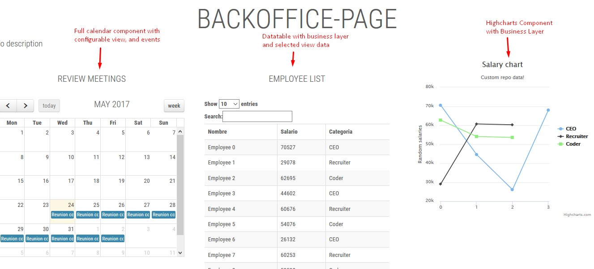
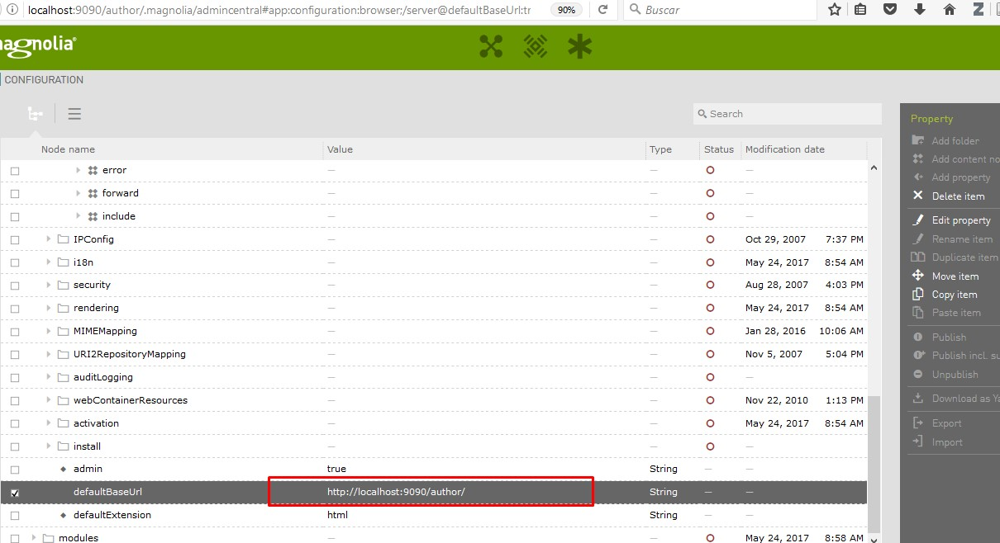
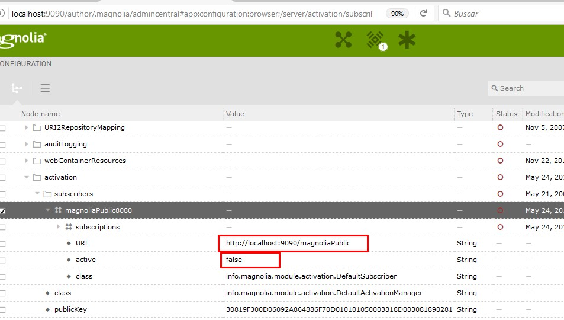
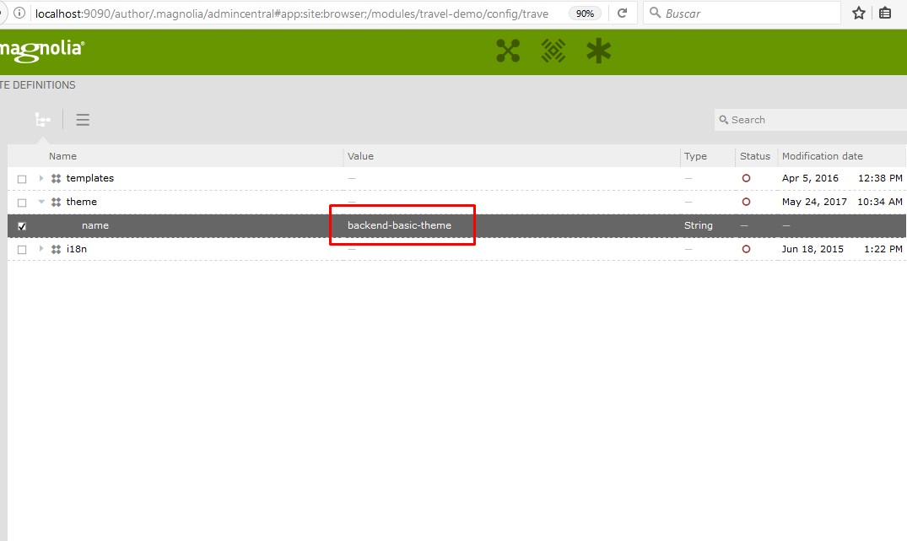

# rd-magnolia-blossom : Rocking your business
## Sorry, this project has been moved to a private repository. Be in touch with me if you need any help or support with this techniques.

You can see details for the demo at [Open expo presentation](http://learning.albertosoto.es/rd2017)

Full project with maven integration, profile for developing, Blossom module, Light module configuration and... Spring MVC with Rest support out of the box
Prepared for any company that search for a real professional template in magnolia CMS.

## Features
- Sets a servlet using Spring MVC configuration and changes behaviours for allowing controllers as rest points out of Magnolia Blossom 
- Uses Magnolia Blossom
- It's set up in the same module for possible mutual redundant logic dependency
- Exposes custom .json api
- Spring services
- Backoffice type component toolkit
- Disposes rd-magnolia-light module: (So it integrates all it's module!) Check docu at [github](https://github.com/albertoSoto/rd-magnolia-light)
- Creates components for business layer: highcharts, fullcalendario and datatables
- Will continue development for sure!

## Usage

- go to backoffice-magnolia-webapp/src/main/filters/local.properties and set your repository data configuration
- deploy & install! Remember to choose your local profile to deploy
- Run magnolia & install
- set config:/server/defaultBaseUrl to your server settings (img)

- to be able to delete in author, customize avoid publish (img2)

- check uri ($yourserver)/api/spring/v1/dummy1/yuhu.json WORKS (That means that dispatcher spring rest servlet works)
- change the default theme to backend-basic-theme (Needs travel-demo module installed!)(img3)

IMPORTANT NOTE:
If your project is already installed you can have problems while setting dispatcher servlet (the default install process does not create the servlet via magnolia module configuration)

## Information on Magnolia CMS

This project is a full Magnolia 5.3 CE project suitable for any company, setting light development techniques, Spring and Blossom
https://docs.magnolia-cms.com

## License
MIT License (c) 2017 Alberto Soto Fernández

## Contributors
* Alberto Soto Fernandez ([github](https://github.com/albertoSoto))

